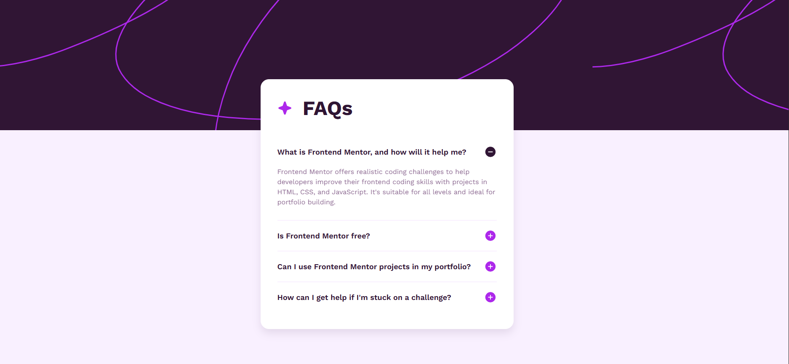
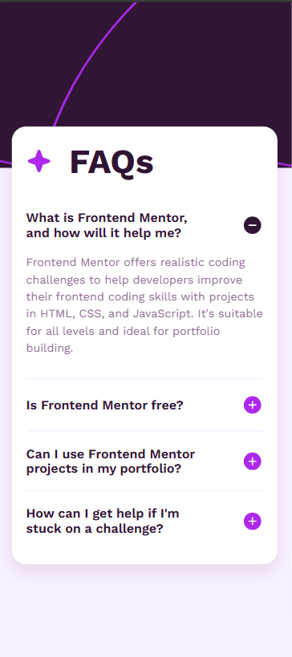

# ❓ FAQ Accordion — Frontend Mentor Challenge

 A responsive FAQ accordion solution for the Frontend Mentor challenge, built with semantic HTML5, modern CSS, and vanilla JavaScript.


## 📌 Live Demo

 🔗 [Click here to view the live project](https://gunnaroliveira.github.io/FAQ-Accordion-FrontEndMentor-Challenge/)


## 📸 Screenshots

### Preview

- Desktop Preview
<p align="center">
  
</p>

- Mobile Preview 
<p align="center">
  
</p>

---

## 📜 About the Project

This project is a solution to the [FAQ Accordion challenge on Frontend Mentor](https://www.frontendmentor.io/challenges/faq-accordion-wyfFqAoS5).

The challenge focuses on building a responsive FAQ accordion interface where users can interact with questions to reveal or hide their corresponding answers.

### The Challenge

Users should be able to:

- View the optimal layout for the site depending on their device's screen size.
- See hover and interactive states for the accordion questions.
- Expand and collapse FAQ answers by clicking on a question.
- Easily read the content on both mobile and desktop devices.

---

## 🛠️ Built With

- **HTML5:** Semantic elements such as `<main>`, `<h1>`, `<dl>`, `<dt>`, and `<dd>` to create a clear and accessible document structure.
- **CSS3:** Custom properties, responsive layouts, typography, animations, and background images.
- **JavaScript:** Vanilla JavaScript is used to control the accordion interactions and dynamically switch between the plus and minus icons.
- **Flexbox:** Used to align and position the main FAQ component and its internal elements.
- **Responsive Design:** The layout adapts between desktop and mobile screen sizes.
- **Mobile-First Approach:** Responsive rules are used to provide an optimized experience across different viewport sizes.
- **Google Fonts:** The project uses the **Work Sans** font family.

---

## 📁 Repository Structure

```text
FAQ-Accordion-FrontEndMentor-Challenge/
├── assets/
│   └── images/                 # Icons, background patterns and favicon
├── css/
│   └── style.css               # Main stylesheet and responsive rules
├── design/                     # Original challenge design references
├── screenshots/                # Project screenshots
├── script/
│   └── script.js               # Accordion interaction logic
├── .gitignore
├── index.html                  # Main HTML structure
├── preview.jpg                 # Project preview
├── README.md                   # Project documentation
└── style-guide.md              # Frontend Mentor style guide
```

---

## 🚀 Getting Started

To run this project locally, follow these steps:

### 1. Clone the repository

```bash
git clone https://github.com/GunnarOliveira/FAQ-Accordion-FrontEndMentor-Challenge.git
```

### 2. Navigate to the project folder

```bash
cd FAQ-Accordion-FrontEndMentor-Challenge
```

### 3. Open the project

Open `index.html` directly in your web browser or use the **Live Server** extension in VS Code.

No additional dependencies or build tools are required.

---

## 🎯 Features

- Responsive FAQ layout
- Interactive accordion
- Plus/minus icon switching
- Smooth opening animation
- Desktop and mobile background patterns
- Responsive typography and spacing
- Semantic HTML structure
- Vanilla JavaScript with no external libraries

---

## 👤 Author & Acknowledgments

- **Challenge by:** [Frontend Mentor](https://www.frontendmentor.io/)
- **Coded by:** Gunnar Oliveira
  - **GitHub:** [@GunnarOliveira](https://github.com/GunnarOliveira)
  - **Frontend Mentor:** [@GunnarOliveira](https://www.frontendmentor.io/profile/GunnarOliveira)

---

> Feel free to explore the project and methodology, share any feedback or suggestions, and don't forget, Jesus Loves You! ✨
